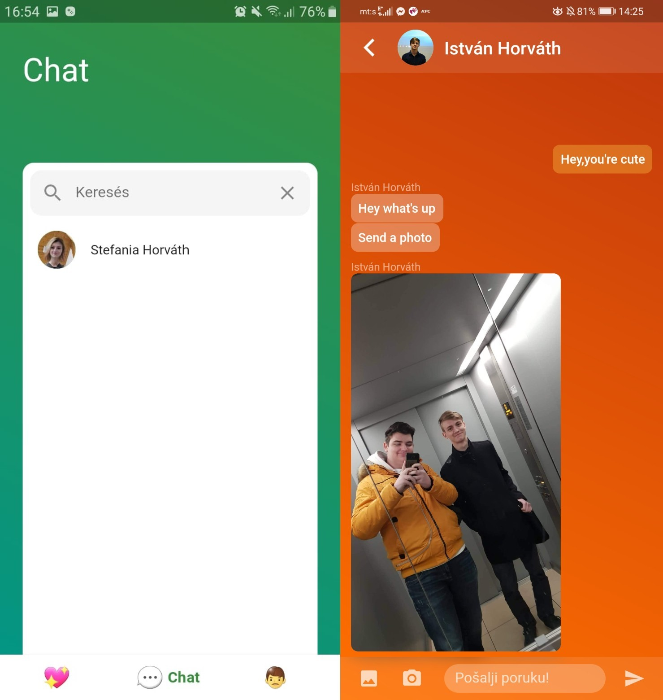

# Face Trace
A dating app that helps you find the best-looking partner, it adapts to your preferences based on your previous swipes.

## Features
- A Matching system with a custom recommendation algorithm that compares facial data.
- Instant messaging with images.
- Customizable app UI.

## Screenshots
- Matching 
- Chat 

## How to build the app

- Install [Flutter](https://docs.flutter.dev/get-started/install)
- Install Android Studio (not necessary, but highly recommended)
- Clone the repo
```shell
git clone https://github.com/Isti01/Face-Trace.git
```
- Restore project files and install packages
```shell
flutter create .
flutter pub get
```
- Install an [Android emulator](https://developer.android.com/studio/run/managing-avds) and run the app. 
```shell
flutter run
```

## Note
Making this app was a lot of fun. I spent a lot of time with it, and I learned a lot not just about app making but I also learned the basics of Firebase.

In the firebase folder you can find the Cloud Functions code that I wrote for background tasks, like sending notifications and matching people.

[This is the machine learning model that I used for this project](https://arxiv.org/abs/1503.03832)
It was a huge struggle for me to get it up and running as a Cloud Function, but with some patience I managed to do it.

This project is open source, you can find it on my GitHub [profile](https://github.com/Isti01/Face-App). 

If you like my work please give it a GitHub star. Feel free to contact me. <horvatska01@gmail.com>